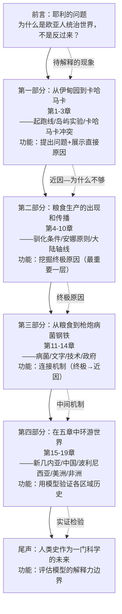
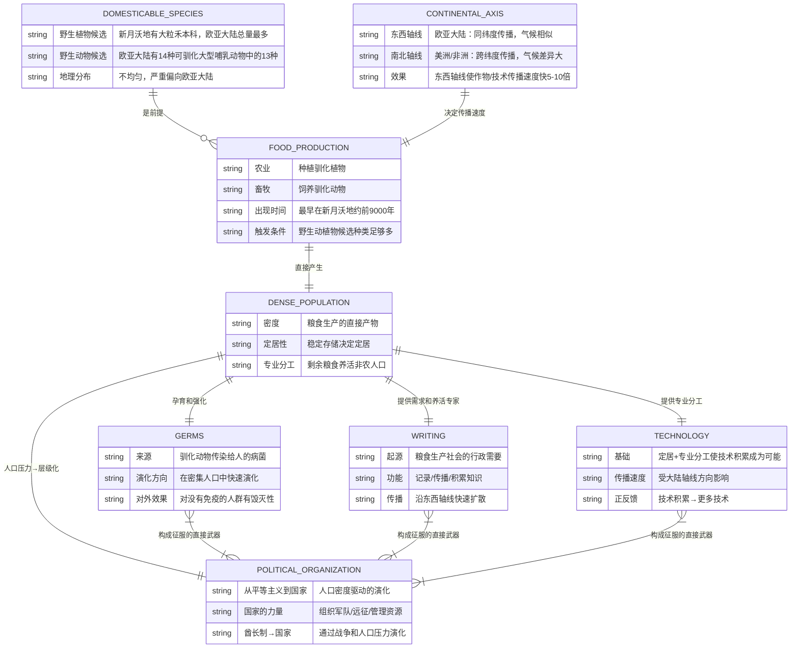
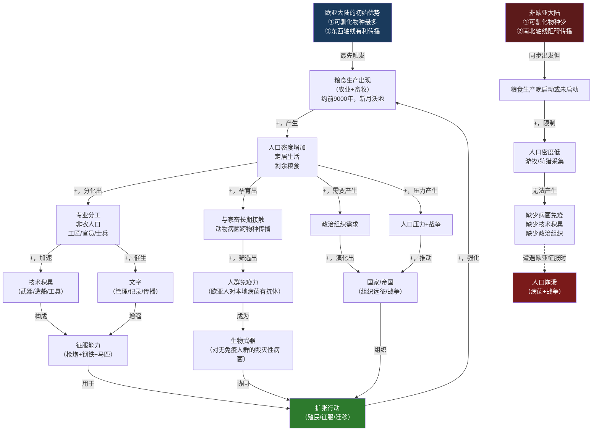

# 《枪炮、病菌与钢铁》建模分析 · 沈老师引擎 v3.4
## 文件一：Pre-Step + 读前诊断 + Step 0 + Step 1

> 书是原料，你是工厂。戴蒙德的论证是原材料，底层因果结构才是你要提取的产出。

---

## Pre-Step：章节分组扫描

**目录结构（19章 + 前言 + 尾声 + 附录）：**



**分组判断：**

> 全书共同构成**同一个因果系统的不同层级**：
> - **现象层**（前言+第1章）：欧亚人为什么主导了公元1500年后的世界？
> - **近因层**（第2-3章）：枪炮/病菌/钢铁/政治组织是直接武器
> - **机制层**（第4-10章）：粮食生产是产生近因的终极原因
> - **连接层**（第11-14章）：粮食→病菌/文字/技术/政府的具体路径
> - **验证层**（第15-19章）：在各大陆对模型进行实证检验
> - **边界层**（尾声）：模型的适用条件和剩余问题

→ **适用"因果系统层级"关系，全书统一建模，不分批。**

拆开任何一层，模型就失去解释力：读第11章（病菌）而不读第7-9章（驯化条件），你会以为病菌是偶然的，而不是粮食生产的系统性产物。

---

## 读前诊断（Pre-read）

**① 书的类型：论证书**

戴蒙德有一个清晰的、可证伪的核心论点，全书用19章的证据来支撑它：**各大陆人类历史发展速度的差异，来自环境差异，不来自种族差异。**

这不是叙事书（虽然有大量故事），不是工具书（没有操作步骤），是一部用历史数据构建因果论证的学术论证书。

**② 我想从这本书里提取什么：**

→ **一个因果解释**：为什么某些大陆的文明发展速度远快于其他大陆？  
→ **一套判断标准**：给我一个历史上的征服/殖民事件，我能用这个模型诊断其根本原因

读前诊断②：提取因果解释为主 → Step 4输出**诊断方向**（一个方向）；但因为有可操作的判断标准可提取，同时输出**预防方向**（分析历史时如何避免错误归因）

---

## Step 0：骨架提取

### 问题定位

这本书要回答的核心问题是：

> **为什么13000年后，是欧亚大陆的人用枪炮、病菌与钢铁征服了世界其他地方，而不是反过来？**

这是一个**因果系统问题**，而且核心是"为什么会自我维持"——为什么欧亚大陆一旦领先，这种领先会通过正反馈不断扩大？

选**因果回路图（CLD）**为骨架主图，辅以**ER图**建立核心实体结构。

---

### 骨架图一：核心实体关系（ER图）



---

### 骨架图二：全书核心因果回路图（CLD）



**反馈环标注：**
- **正反馈环（+越来越强）**：粮食生产→人口密度→技术/政治组织→扩张→获得更多资源→强化粮食生产（文明的自催化）
- **正反馈环（病菌军备竞赛）**：与动物接触→病菌感染→免疫存活→更强免疫力→下一代更强（自然选择）
- **负反馈（无）**：戴蒙德的论证里几乎没有内生的负反馈机制——一旦欧亚大陆启动，没有内生力量能让它停下来

**完成标志：** ✓ 看着图，对这本书有60%的直觉——这不是一本讲"西方为什么厉害"的书，而是一本在说"地球上那块土地的初始条件最好，那块土地的人就赢了，和人本身没有关系"。

---

## Step 1：概念速览

以下是《枪炮、病菌与钢铁》的核心概念清单。

---

**1. 终极原因（Ultimate Causes）vs 近因（Proximate Causes）**
近因：枪炮/病菌/钢铁/政治组织——这些是直接杀死印第安人或击败对手的工具。
终极原因：为什么欧亚人有这些工具而印第安人没有？答案是粮食生产的差异，而粮食生产的差异来自环境。
例子：皮萨罗俘获阿塔瓦尔帕，近因是西班牙人有马匹/钢剑/火枪/病菌；终极原因是欧亚大陆有可驯化的马和合适的野生植物，从而早几千年发展出粮食生产体系，从而产生了这些近因。
→ **进Step 2**（边界：什么情况下近因可以脱离终极原因独立解释历史？日本明治维新是近因借用还是终极原因的延伸？）

---

**2. 安娜·卡列尼娜原则（Anna Karenina Principle）**
托尔斯泰："幸福的家庭都是相似的，不幸的家庭各有各的不幸。"迁移到驯化动物：成功驯化需要同时满足一系列条件（食性/生长速度/圈养繁殖/群居结构/性情温顺/不易受惊），只要有一个条件不满足就失败。这就解释了为什么世界上候补的大型哺乳动物很多，但驯化成功的只有14种，而且13种集中在欧亚大陆。
例子：斑马满足食性/群居条件，但性情凶暴且无法套索，一个条件不满足，永远无法驯化。北美有大量野牛但无法驯化，主要是圈养不繁殖+过于易惊。
→ **进Step 2**（边界：这个原则同样适用于植物吗？单一条件失败 vs 多条件权衡？）

---

**3. 可驯化物种的地理分布不均**
地球上大约200种野生大型食草哺乳动物，满足驯化条件的只有14种，其中13种原产于欧亚大陆（包括马、牛、羊、猪）。野生植物方面，适合驯化的大粒禾本科植物，新月沃地就有32种，北美东部只有4种，墨西哥中部只有2种。
例子：印加人的安第斯山脉只有美洲驼可驯化，没有马——这不是印加人懒，是南美根本没有野马。
→ **进Step 2**（边界：物种分布不均是"初始条件"还是"历史偶然"？人类本身导致的物种灭绝是否改变了初始条件？）

---

**4. 大陆轴线走向（Continental Axis Orientation）**
欧亚大陆主轴线：东西向——相同纬度意味着相同气候/光周期/季节，作物和牲畜可以沿东西方向快速传播。
美洲/非洲主轴线：南北向——作物传播必须跨越气候带，驯化于温带的小麦无法在热带存活，速度极慢。
例子：新月沃地的小麦在500年内传遍欧洲（东西传播），但玉米从墨西哥传到美国东北部花了数千年（南北传播，跨越气候带）。
→ **进Step 2**（边界：轴线方向是"决定性"的还是"重要因素之一"？中美洲是东西向的，但为什么文明发展相对缓慢？）

---

**5. 病菌的动物起源（Germs from Domesticated Animals）**
人类历史上最大的杀手（天花/流感/麻疹/鼠疫/结核）几乎都来自驯化动物：牛→天花/麻疹；猪/鸭→流感；鼠疫来自鼠。欧亚大陆长期与大量家畜共处，病菌跨物种传播后，人群通过自然选择获得了部分免疫力。新大陆/澳大利亚/非洲南部人群没有经历过这个过程，对欧亚病菌完全无免疫。
例子：哥伦布1492年到达后，欧亚病菌（主要是天花）在几十年内杀死了90-95%的美洲土著——比西班牙军队的直接杀戮多几十倍。
→ **进Step 2**（边界：病菌免疫力是单向的吗？为什么"印第安人的病菌"没有大规模反向传入欧洲？）

---

**6. 粮食生产 → 密集人口 → 专业分工（Food Production Chain）**
不是农业本身使欧亚人强大，而是农业通过中间机制产生的一系列结果：剩余粮食→养活非农人口→专职工匠/官员/士兵/发明家→技术积累/政治组织/文字。狩猎采集族群无法养活这类专业人员，因此无论他们多聪明，技术积累速度远慢于粮食生产社会。
例子：古埃及的金字塔，不是建造技术问题，是组织问题——需要养活数千名专职建筑工人几十年，只有有剩余粮食的国家才能做到。
→ **进Step 2**（边界：剩余粮食是必要条件还是充分条件？印加帝国有剩余粮食但没有文字，说明什么？）

---

**7. 盗贼统治（Kleptocracy）与政治组织的演化**
从平等的狩猎采集族群（几十人）到部落（数百人）到酋长制（数千人）到国家（数万人以上），这个演化过程是人口密度增加的产物，不是领导人智慧的产物。每个阶段，统治者都面向被统治者做出某些让步（提供公共服务/安全/再分配）来维持合法性，同时截留相当一部分财富，这就是"盗贼统治"——它不是腐败的偶然，而是等级社会的结构性特征。
例子：夏威夷酋长每年向农民征收粮食，然后用于举办宴会/建造神庙/维持武士——盗贼和公益赞助者的边界只是程度问题。
→ **进Step 2**（边界：盗贼统治是等级社会的必然，还是某些特定条件下才出现？是否有不盗窃的国家形态？）

---

**8. 自催化式文明发展（Autocatalytic Civilization）**
戴蒙德隐含但未明说的一个关键机制：文明发展是自我加速的正反馈系统。粮食→人口→技术→更多粮食；技术→更好武器→更多征服→更多资源→更多技术；文字→知识积累→更快技术→更快文字发展。一旦某个大陆启动这个正反馈，在没有外部干预的情况下，领先优势会指数级扩大。
例子：欧亚大陆在公元前3000年的技术领先（青铜器/文字），到公元1500年已经积累成几乎无法逾越的征服优势，而那时澳大利亚还在石器时代——不是几百年的差距，是几千年正反馈积累的鸿沟。
→ **进Step 2**（边界：自催化系统是否有天花板？日本/东亚如何"搭便车"进入这个系统？）

---

**Step 1 待执行清单（全部进Step 2）：**

```
☐ 终极原因 vs 近因
☐ 安娜·卡列尼娜原则（驯化条件）
☐ 可驯化物种的地理分布不均
☐ 大陆轴线走向
☐ 病菌的动物起源
☐ 粮食生产→密集人口→专业分工
☐ 盗贼统治与政治组织演化
☐ 自催化式文明发展
```

---

*→ 继续文件二：Step 2 实例裁判循环*
