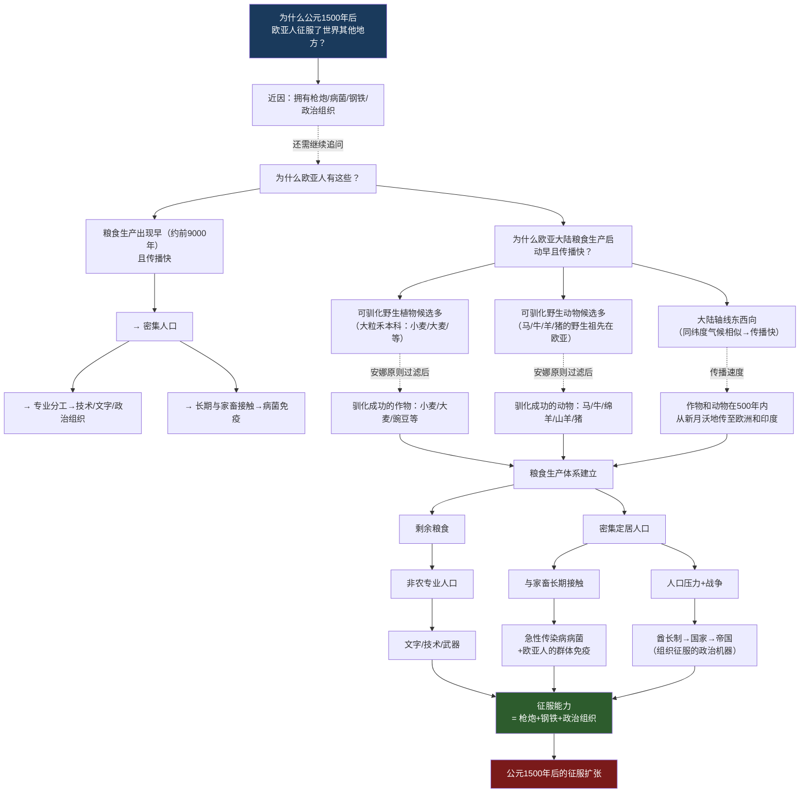
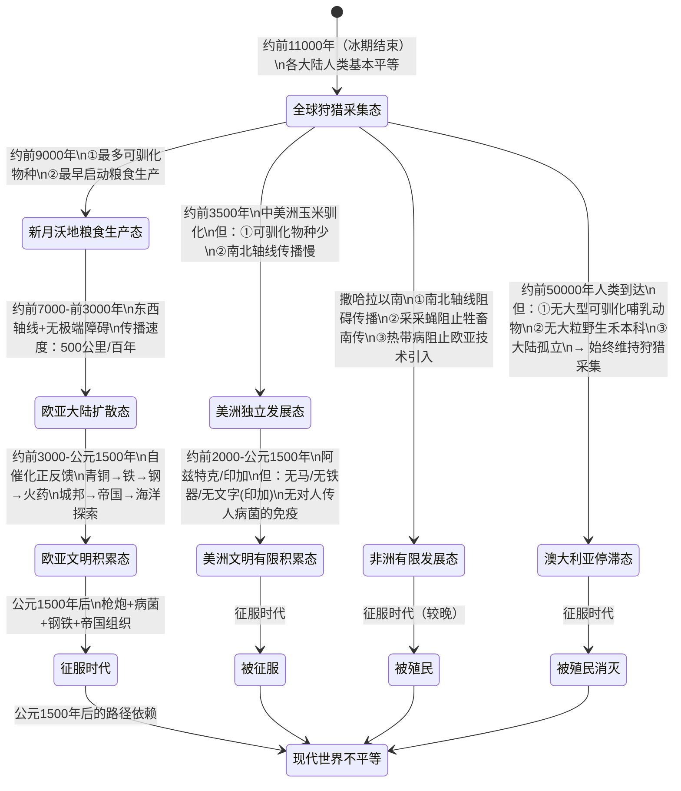
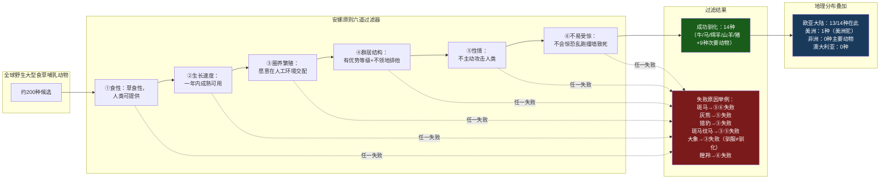
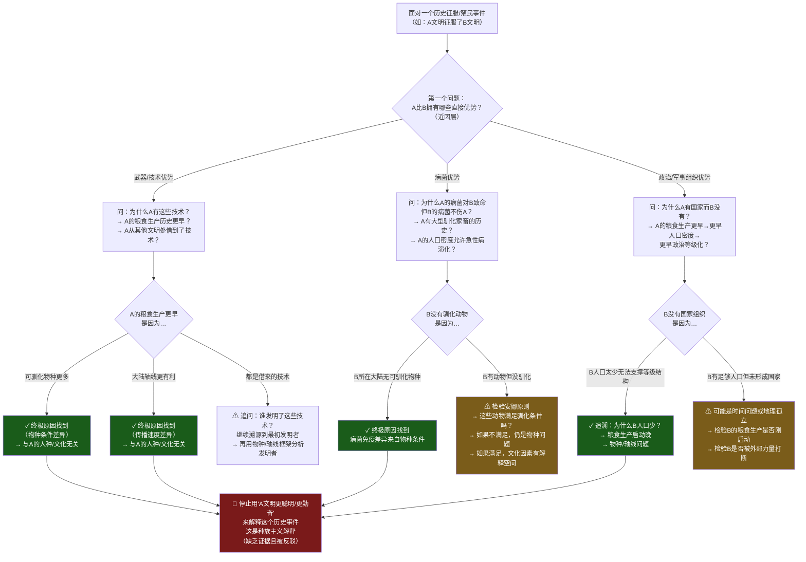
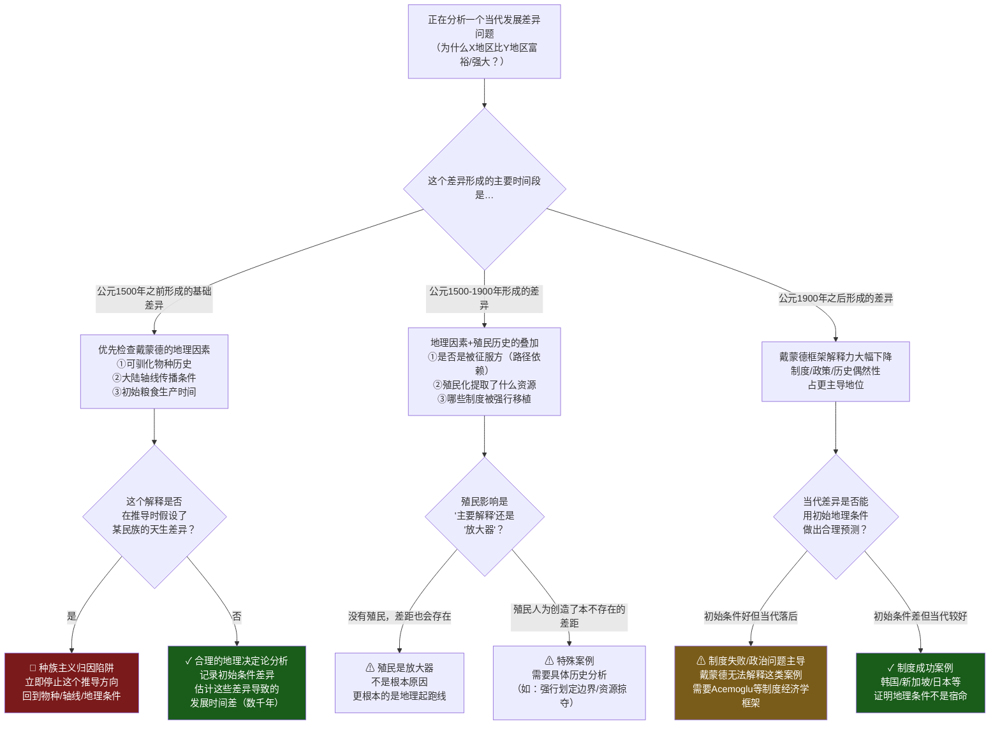

# 《枪炮、病菌与钢铁》建模分析 · 沈老师引擎 v3.4
## 文件三：Step 3 结构可视化 + Step 4 可执行模型

---

## Step 3：结构可视化

**核心原则：画不出来的地方 = 真正没理解的地方。**

---

### 图一：全书核心因果结构（Why-Why树 + 因果链）



---

### 图二：各大陆的比较状态机



---

### 图三：安娜·卡列尼娜原则的过滤器图



---

### 差异列表

**【原文有、图里没有体现的内容】**

1. **波利尼西亚案例（第17章）作为"人类历史的天然实验"**：在小规模/短时间内，波利尼西亚人从同一祖先出发，在不同岛屿环境下发展出从狩猎采集部落到原始帝国的全谱系社会形态。这是戴蒙德最有力的"可控实验"证据，图里表达不足。

2. **更新世大灭绝对美洲和澳大利亚的影响**：约1.3万年前，美洲和澳大利亚经历了大型哺乳动物的大规模灭绝，时间与人类到达高度相关。这减少了这两个大陆的可驯化动物候选池，且可能是人类过度猎杀造成的——意味着美洲/澳大利亚的不利初始条件，本身可能是早期人类活动的结果，不是纯粹的地理偶然。图里没有标注这个"人类导致的初始条件恶化"。

3. **欧洲内部竞争对技术发展的加速效应**：戴蒙德在书的末尾提到，欧洲多国竞争体系（不同于中国的单一帝国）加速了技术应用——郑和舰队被废止，哥伦布被一个国家拒绝后找另一个国家支持，欧洲的竞争使技术创新难以被扼杀。这是一个重要的补充机制，图里只有"自催化"节点，没有"竞争性政治结构"这个加速器。

4. **文字传播的"蓝图传播"vs"独立发明"的细节**：大多数文字是通过"借用思想"（知道文字存在并自行发展）而非直接复制传播的。这个机制很有意思（不需要直接接触，只需要知道"这东西可行"），图里没有表达。

**【图里有、原文没有明说的推论】**

1. **"自催化"作为独立机制节点**：原书描述了粮食→技术→更多技术的过程，但没有用"自催化正反馈"这个明确的系统性标签。这是我从书中提炼出的结构标签。

2. **状态机中"澳大利亚停滞态"的永久性**：原书说明澳大利亚始终维持狩猎采集，但没有明确标注这是"永久停滞"——实际上如果欧洲人不来，澳大利亚可能继续狩猎采集但不代表"永久无法发展"，只是发展极慢。图里的标注有些过于决定论。

3. **各大陆进入征服时代的"时间差"可以用发展速度差来精确量化**：图里用状态机表达了各大陆发展轨迹的差异，但没有表达这种差异是量级性的（欧亚领先了数千年而不只是几百年）。

---

## Step 4：可执行模型

**读前诊断②**：提取因果解释+判断标准 → **两个方向：诊断 + 预防**

---

### 核心机制（一句话）

**哪个大陆有最多可驯化的野生物种、最有利的传播轴线，那个大陆的人就会最先建立粮食生产，从而积累出病菌免疫/技术/文字/政治组织这些征服武器——这是一个地理决定的起跑线差异，与人种无关。**

---

### 触发条件 → 结果

```
当[某地区有大量可驯化野生物种+有利的传播方向]时 → 粮食生产早启动，积累领先数千年
当[某地区可驯化物种稀少+南北轴线+生态障碍]时 → 粮食生产启动晚或不启动
当[粮食生产+密集人口+长期与家畜接触]时 → 当地人群对多种急性传染病有部分免疫
当[没有长期与家畜接触]时 → 对欧亚病菌无免疫，接触即大规模死亡
当[粮食生产社会遭遇狩猎采集社会]时 → 病菌+技术+人数优势几乎必然胜出（除非特殊地形）
当[竞争性多国体系而非单一大帝国]时 → 技术发展自催化速度加快
```

---

### 诊断方向：分析某个历史上的征服/殖民事件的根本原因



---

### 预防方向：分析当代地缘政治/发展问题时，避免错误归因



---

### 失效边界

**这个模型在以下情况下不适用或预测力下降：**

1. **分析公元1900年之后的发展差异**：韩国和朝鲜有相同的地理起跑线，却在60年内产生了巨大的发展差异——地理决定论完全无法解释这类案例。制度、政策、偶然性（战后援助）等因素主导。

2. **解释为什么欧亚大陆内部差异（为什么是西欧而非中国）**：戴蒙德解释了为什么欧亚大陆整体领先，但对欧亚大陆内部差异（为什么最终是欧洲而非中国的文明主导了1500年后的扩张）解释力有限。他在书末承认这是一个未解问题。

3. **解释"文化因素的自主性"**：日本明治维新、韩国经济腾飞都是文化/政治因素突破地理约束的例子。戴蒙德的框架能解释"起跑线"，但不解释起跑后的"选择"。

4. **戴蒙德作为参与者的偏见**：他是美国学者，他的框架倾向于为欧洲征服提供一种"去道德化"的解释（"不是欧洲人更坏，只是地理运气更好"）——这个立场本身就是一个价值观选择，影响了他对反证的处理方式。

---

*→ 继续文件四：Step 5 接入已有体系 + 建模完成自检 + 一句话总结*
